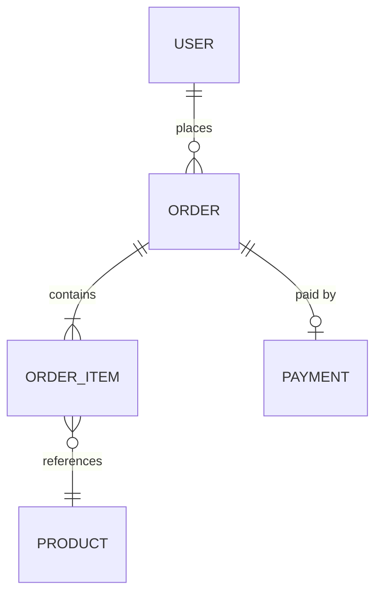
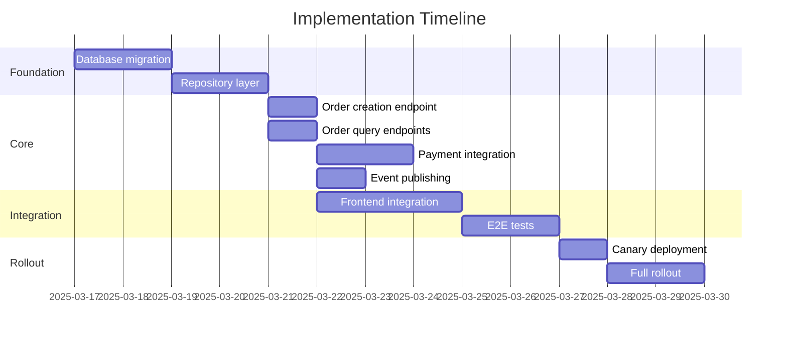

# SDD Writer Skill

You are an expert at writing Software Design Documents. An SDD is a comprehensive plan for implementing a feature, service, or system. When the user asks you to write an SDD, follow this guide precisely.

## 1. When to Write an SDD

Write an SDD for:
- New features that span multiple components or services.
- System migrations or major refactors.
- New services or infrastructure components.
- Changes that affect data models, APIs, or system behavior in ways other teams depend on.

Do NOT write an SDD for:
- Bug fixes.
- Small, isolated changes contained within a single module.
- Configuration changes.

## 2. File Conventions

- Store SDDs in a `docs/design/` directory.
- Name files with a date prefix and slug: `YYYY-MM-DD-short-description.md`.
- Example: `2025-03-15-order-processing-pipeline.md`.

## 3. SDD Template

Use this template for every SDD. All sections are mandatory unless marked optional.

```markdown
# [Title]: Software Design Document

**Author(s)**: [names]
**Reviewers**: [names]
**Date**: YYYY-MM-DD
**Status**: Draft | In Review | Approved | Implemented | Abandoned

---

## 1. Objective

State what this design achieves in 2-3 sentences. Answer: "What problem does this solve and why does it matter?"

## 2. Scope

### In Scope

- Bullet list of what this design covers.

### Out of Scope

- Bullet list of what this design explicitly does NOT cover.
- Explain why each item is out of scope if not obvious.

## 3. Background

Provide context a new team member would need to understand this design:
- Current system state.
- Previous attempts or related work.
- Link to relevant ADRs, RFCs, or prior SDDs.
- Business context and motivation.

## 4. Technical Approach

### 4.1 High-Level Architecture

Describe the overall approach. Include a Mermaid diagram showing how components interact.

### 4.2 Detailed Design

Break the approach into subsections. Cover:
- New components being introduced.
- Changes to existing components.
- Interaction patterns (synchronous calls, async events, etc.).
- Authentication and authorization model.

### 4.3 Data Model

Define new or modified database tables, documents, or data structures.

For relational databases, use this format:

| Column | Type | Constraints | Description |
|--------|------|------------|-------------|
| id | UUID | PK | Unique identifier |
| user_id | UUID | FK -> users.id, NOT NULL | Owner |
| status | VARCHAR(20) | NOT NULL, DEFAULT 'pending' | Order status |
| total_amount | DECIMAL(10,2) | NOT NULL | Total in USD |
| created_at | TIMESTAMPTZ | NOT NULL, DEFAULT NOW() | Creation time |
| updated_at | TIMESTAMPTZ | NOT NULL, DEFAULT NOW() | Last update |

Include an ER diagram for complex models:



Document indexes:
- `idx_orders_user_id` on `orders(user_id)` -- frequent lookup by user.
- `idx_orders_status_created` on `orders(status, created_at)` -- dashboard queries.

### 4.4 API Design

For each new or modified endpoint:

**POST /api/v1/orders**

| Property | Value |
|----------|-------|
| Method | POST |
| Path | /api/v1/orders |
| Auth | Bearer token (JWT) |
| Rate Limit | 100 req/min per user |

Request body:
```json
{
  "items": [
    { "product_id": "uuid", "quantity": 1 }
  ],
  "shipping_address_id": "uuid"
}
```

Response (201):
```json
{
  "id": "uuid",
  "status": "pending",
  "total_amount": 49.99,
  "created_at": "2025-03-15T10:30:00Z"
}
```

Error responses:

| Status | Code | Description |
|--------|------|-------------|
| 400 | INVALID_REQUEST | Missing or malformed fields |
| 401 | UNAUTHORIZED | Invalid or missing token |
| 422 | INSUFFICIENT_STOCK | One or more items out of stock |

### 4.5 Error Handling

Define the error handling strategy:

| Error Category | Strategy | Example |
|---|---|---|
| Validation errors | Return 400 with field-level details | Missing required field |
| Business rule violations | Return 422 with error code | Insufficient stock |
| Transient failures | Retry with exponential backoff (max 3 attempts) | Database timeout |
| Downstream service failures | Circuit breaker, fallback response | Payment gateway down |
| Unexpected errors | Log, return 500 with correlation ID | Null pointer |

Define retry policy:
- **Max retries**: 3
- **Backoff**: Exponential with jitter (1s, 2s, 4s)
- **Idempotency**: All mutating endpoints must accept an `Idempotency-Key` header.

Define dead letter handling:
- Failed messages after max retries go to a dead letter queue.
- Alert on dead letter queue depth > 10.
- Manual review and replay process documented in runbook.

## 5. Security Considerations

- Authentication mechanism.
- Authorization rules (who can access what).
- Data encryption (at rest, in transit).
- PII handling and data retention.
- Input validation and sanitization.

## 6. Observability

Define what to monitor:

### Metrics
- Request rate, error rate, latency (p50, p95, p99) per endpoint.
- Queue depth and consumer lag.
- Database connection pool utilization.

### Logs
- Structured JSON logs with correlation ID.
- Log levels: ERROR for failures, WARN for degraded behavior, INFO for key business events.

### Alerts
| Alert | Condition | Severity |
|-------|-----------|----------|
| High error rate | > 5% of requests return 5xx over 5 min | Critical |
| High latency | p99 > 2s over 5 min | Warning |
| Queue backlog | Depth > 1000 for 10 min | Warning |

## 7. Testing Strategy

| Test Type | Scope | Tools |
|-----------|-------|-------|
| Unit tests | Individual functions and methods | Jest / pytest |
| Integration tests | API endpoints with real database | Supertest + test containers |
| Contract tests | API compatibility between services | Pact |
| Load tests | Performance under expected and peak load | k6 / Artillery |

Define acceptance criteria for launch:
- Unit test coverage > 80% for new code.
- All integration tests pass.
- Load test confirms p99 < 500ms at 2x expected peak load.

## 8. Migration and Rollout Plan

### Migration Steps
1. Deploy database migration (backward compatible).
2. Deploy new service version with feature flag disabled.
3. Enable feature flag for internal users (canary).
4. Monitor for 24 hours.
5. Enable for 10% of users, then 50%, then 100%.
6. Remove feature flag after 2 weeks of stable operation.

### Rollback Plan
- Feature flag disable reverts to previous behavior instantly.
- Database migration is backward compatible; no DDL rollback needed.
- If rollback is needed after data has been written, describe the data cleanup procedure.

## 9. Risks and Mitigations

| Risk | Likelihood | Impact | Mitigation |
|------|-----------|--------|------------|
| Payment gateway latency spikes | Medium | High | Circuit breaker + async processing with retry |
| Data inconsistency during migration | Low | Critical | Run migration in transaction, validate with checksums |
| Scope creep | High | Medium | Strict scope defined above, defer additions to follow-up SDD |

## 10. Open Questions

List unresolved questions that need answers before implementation starts:

- [ ] Question 1: Details and who needs to answer.
- [ ] Question 2: Details and who needs to answer.

## 11. Timeline and Task Breakdown

### Phase 1: Foundation (Week 1)
- [ ] Task 1.1: Description (estimated hours)
- [ ] Task 1.2: Description (estimated hours)

### Phase 2: Core Implementation (Week 2-3)
- [ ] Task 2.1: Description (estimated hours)
- [ ] Task 2.2: Description (estimated hours)

### Phase 3: Integration and Testing (Week 4)
- [ ] Task 3.1: Description (estimated hours)
- [ ] Task 3.2: Description (estimated hours)

### Phase 4: Rollout (Week 5)
- [ ] Task 4.1: Description (estimated hours)
- [ ] Task 4.2: Description (estimated hours)

**Total Estimated Effort**: X person-days
```

## 4. Task Breakdown Guidelines

When breaking the SDD into tasks, follow these rules:

### Sizing
- Each task should be completable in **2-8 hours** by one engineer.
- If a task is larger than 8 hours, break it into subtasks.
- If a task is smaller than 1 hour, merge it with a related task.

### Ordering
- Tasks must be ordered by dependency. No task should depend on a later task.
- Group tasks into phases. Each phase can have parallel tasks but phases are sequential.
- Infrastructure and data model changes come first.
- API and business logic come second.
- Frontend and integration come third.
- Testing and rollout come last.

### Task Format

Each task should include:

```markdown
### Task 2.3: Implement order creation endpoint

**Estimated effort**: 4 hours
**Dependencies**: Task 2.1 (data model migration), Task 2.2 (repository layer)
**Assignee**: [name or "unassigned"]

**Description**:
Implement POST /api/v1/orders endpoint in the Order Controller.

**Acceptance Criteria**:
- Validates request body against schema.
- Creates order record with status "pending".
- Returns 201 with order ID and status.
- Returns 400 for invalid input.
- Returns 422 when product stock is insufficient.
- Covered by integration tests.

**Technical Notes**:
- Use Zod for request validation.
- Wrap DB operations in a transaction.
- Emit "order.created" event after successful insert.
```

### Dependency Visualization

For complex projects, include a dependency graph:



## 5. Writing Guidelines

- **Be precise**: Specify versions, configurations, and exact behavior. "Use Redis" is not enough; write "Use Redis 7.x as a write-through cache with a 15-minute TTL for user session data."
- **Design for the reviewer**: The SDD will be reviewed by peers. Make it easy to spot gaps by being explicit about what is and is not covered.
- **Include diagrams**: A Mermaid diagram is worth a thousand words. Use sequence diagrams for flows, ER diagrams for data models, and flowcharts for decision logic.
- **Quantify**: Include numbers for performance targets, data volumes, cost estimates, and timelines.
- **Address failure modes**: For every operation, ask "what happens when this fails?" and document the answer.
- **Keep it updated**: Mark the SDD as "Implemented" when the work is done. Note any deviations from the original design.

## 6. Review Checklist

Before submitting the SDD for review, verify:

- [ ] Objective is clear and measurable.
- [ ] Scope explicitly lists what is in and out.
- [ ] Architecture diagram is included and matches the text.
- [ ] Data model covers all new and modified entities.
- [ ] Every API endpoint has request/response examples and error codes.
- [ ] Error handling strategy covers validation, business, transient, and unexpected errors.
- [ ] Security section addresses authentication, authorization, and data protection.
- [ ] Observability section defines metrics, logs, and alerts.
- [ ] Testing strategy covers unit, integration, and load testing.
- [ ] Rollout plan includes canary and rollback procedures.
- [ ] All risks have likelihood, impact, and mitigation.
- [ ] Open questions list people responsible for answering.
- [ ] Timeline has tasks sized between 2-8 hours with dependencies.
- [ ] Total estimated effort is realistic.

## 7. Process

When the user asks you to write an SDD:

1. Clarify the feature or system to be designed (ask questions if the scope is unclear).
2. Review existing code and architecture to understand the current state.
3. Write the SDD using the template above, filling all sections.
4. Break the implementation into phased tasks with estimates.
5. Save to `docs/design/YYYY-MM-DD-slug.md`.
6. Present the SDD to the user for review, highlighting open questions and key risks.
