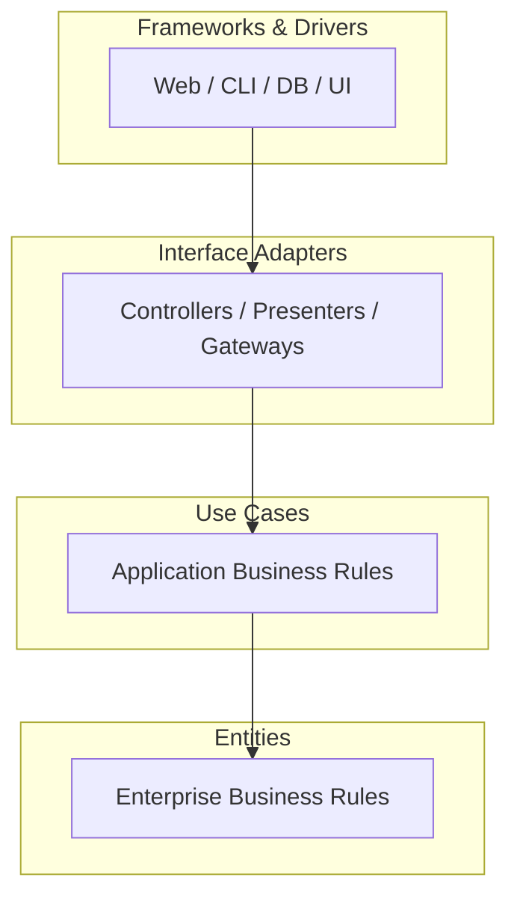

# Clean Architecture

Business rules at the center, framework/IO at the edges. Uncle Bob's synthesis of Hexagonal, Onion, and DDD.

## The Dependency Rule

> Source code dependencies point **only inward**.

Inner layers know nothing about outer layers. Outer layers depend on abstractions defined by inner layers.

## Layers



1. **Entities**: Enterprise-wide business objects and invariants. Pure.
2. **Use Cases**: Application-specific orchestration. Input/output ports.
3. **Interface Adapters**: Convert formats. Controllers, presenters, repository impls.
4. **Frameworks & Drivers**: Django, Spring, Postgres, React, HTTP.

## Ports & Adapters

Use cases declare **ports** (interfaces). Outer layer provides **adapters** (implementations). Dependency Inversion crosses the boundary.

```python
# use_cases/ports.py (inner)
class UserRepository(Protocol):
    def get(self, id: str) -> User: ...
    def save(self, user: User) -> None: ...

# use_cases/register_user.py (inner)
class RegisterUser:
    def __init__(self, repo: UserRepository, mailer: Mailer):
        self.repo, self.mailer = repo, mailer

    def execute(self, cmd: RegisterCmd) -> UserId:
        user = User.create(cmd.email, cmd.password)  # entity invariants
        self.repo.save(user)
        self.mailer.send_welcome(user.email)
        return user.id

# adapters/postgres_user_repo.py (outer)
class PostgresUserRepository(UserRepository):
    def save(self, user): ...  # real SQL
```

## Typical Folder Layout

```
src/
  domain/        # entities, value objects
  application/   # use cases, ports
  infrastructure/# DB, HTTP clients, adapters
  interfaces/    # HTTP controllers, CLI, jobs
  main/          # composition root / DI wiring
```

## Testing Benefits

- **Entities & use cases**: pure unit tests, no framework.
- **Adapters**: integration tests.
- **Swap** Postgres for in-memory fake in tests — same port.

## Rules of Thumb

- Entities never import from `infrastructure`.
- Use cases never import a web framework.
- Frameworks are **plugins**, not foundations.
- Compose at the **main** / composition root only.
- DTOs cross boundaries — don't leak entities to HTTP.

## Anti-patterns

- **Anemic domain**: entities that are just bags of getters/setters.
- **Leaky abstractions**: `UserRepository.find_by_sql(...)`.
- **Use cases calling ORM directly**.
- **Circular imports** between layers.
- Over-layering for a CRUD app with no real business rules.
