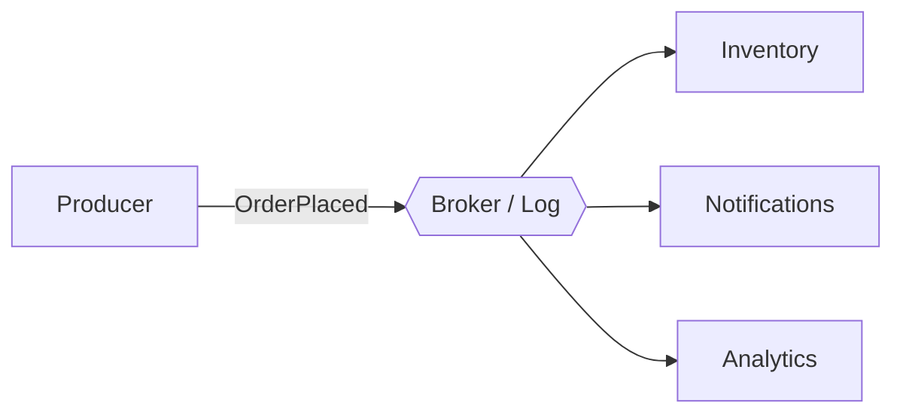
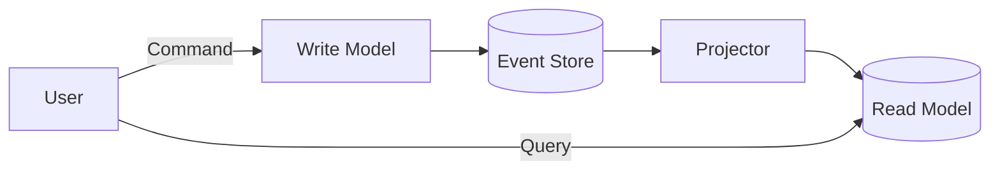

# Event-Driven Architecture (EDA)

Services react to **events** — immutable facts about something that happened.

## Event vs Command vs Message

- **Command**: Intent, imperative (`PlaceOrder`). One handler, may be rejected.
- **Event**: Past tense fact (`OrderPlaced`). Many subscribers, cannot be rejected.
- **Message**: Transport envelope for either.

Naming: events are **past tense** — `PaymentCaptured`, not `CapturePayment`.

## Topology



## Brokers

| Tool | Model | Use |
|------|-------|-----|
| Kafka | Log (replayable, partitioned) | Event sourcing, streams |
| RabbitMQ | Queue / exchanges | Task distribution |
| NATS / Redis Streams | Lightweight pub/sub | Low-latency, simple |
| SNS + SQS | Managed fanout + queues | AWS-native |

## Delivery Semantics

- At-most-once: fast, may lose.
- **At-least-once**: default; require **idempotent** consumers (dedupe by event ID).
- Exactly-once: only within a system (Kafka transactions); end-to-end is a myth — design for idempotency.

## Event Sourcing

Store the sequence of events as the source of truth; derive state by folding them.

```
events: [AccountOpened, Deposited(100), Withdrawn(30)]
state:  Account(balance=70)
```

Benefits: full audit, temporal queries, rebuild projections.
Costs: schema evolution, snapshotting, mental shift.

## CQRS (Command Query Responsibility Segregation)

Separate write model (commands → events) from read models (projections).



Pairs naturally with Event Sourcing but works without it. Enables independent scaling and tailored read schemas.

## Key Patterns

- **Transactional Outbox**: write event to an outbox table in the same DB transaction; a relay publishes it. Avoids dual-write problems.
- **Saga**: long-running workflow via events + compensations.
- **Event-carried State Transfer**: event carries enough state so consumers don't call back.
- **Dead Letter Queue (DLQ)**: poison messages isolated for inspection.

## Schema Evolution

- Versioned event types (`OrderPlaced.v2`).
- Additive changes only; never rename/remove fields in an existing version.
- Consumers tolerate unknown fields (tolerant reader).
- Schema registry (Avro/Protobuf) for contracts.

## Anti-patterns

- **Event as command** (`SendEmail` published to a topic).
- **Chatty fine-grained events** causing N+1 storms.
- **Shared event schemas** tightly coupling producers/consumers.
- **Non-idempotent consumers** on at-least-once delivery.
- **Event sourcing by default** — only where audit/temporal value is real.
- Losing causality: always propagate `correlationId` + `causationId`.
