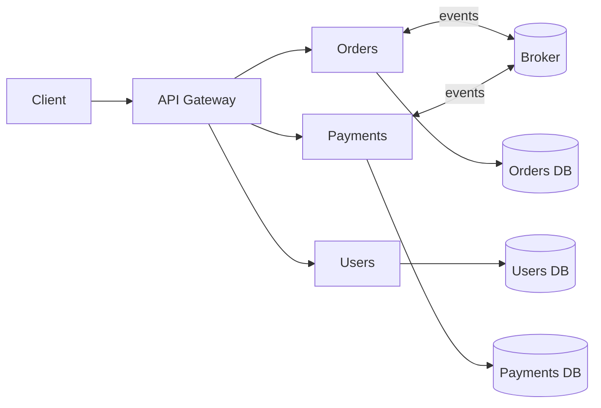

# Microservices

Independently deployable services organized around business capabilities.

## When (and when NOT) to use

Use when: team scaling pain, independent deploy cadence, heterogeneous scaling/tech needs.
Avoid when: small team, unclear domain, no CI/CD maturity. Start with a **modular monolith** first.

## Bounded Contexts (DDD)

Each service owns a bounded context — a model consistent within its boundary.

- One team per context.
- **Private data**: no shared DB between services.
- Communicate only via APIs/events.
- Context map defines relationships (customer/supplier, conformist, ACL).

## Topology

## Key Components

- **API Gateway**: Single entry, auth, rate limit, routing, composition. (Kong, Envoy, AWS API GW.)
- **Service Discovery**: Dynamic registry (Consul, k8s DNS).
- **Service Mesh**: Sidecar (Envoy) for mTLS, retries, traffic split, observability. (Istio, Linkerd.)
- **Message Broker**: Async events (Kafka, RabbitMQ, NATS).
- **Config & Secrets**: Centralized (Vault, SSM).

## Communication Styles

| Style | Use | Risk |
|-------|-----|------|
| Sync REST/gRPC | Query, low latency needs | Cascading failures |
| Async events | State changes, decoupling | Eventual consistency |
| Orchestration (saga) | Cross-service workflow | Central coupling |
| Choreography | Event-driven workflow | Hard to trace |

## Resilience Patterns

- **Timeouts** (always).
- **Retries with exponential backoff + jitter** (idempotent only).
- **Circuit breaker** (Hystrix/Resilience4j).
- **Bulkhead** (isolate thread pools).
- **Fallback** (degraded response).
- **Idempotency keys** on writes.

## Data

- **Database per service** — no cross-service joins.
- **Saga** for distributed transactions (compensations, not 2PC).
- **Outbox pattern**: publish events atomically with DB commit.
- **CQRS** where read/write shapes diverge.

## Observability (three pillars)

- **Logs**: structured, correlation ID per request.
- **Metrics**: RED (Rate, Errors, Duration) + USE.
- **Traces**: distributed (OpenTelemetry, Jaeger, Tempo).

## Anti-patterns

- **Distributed monolith**: services that must deploy together.
- **Shared DB**: kills independence.
- **Nanoservices**: too fine-grained, chatty.
- **Entity services**: CRUD-per-table, not business capabilities.
- Starting with microservices on day one.
