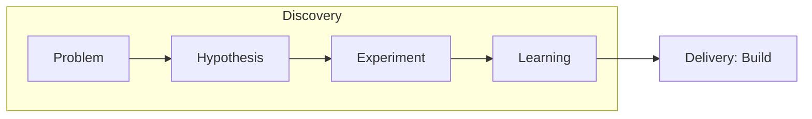

# Product Discovery

Reducing risk **before** building. Answer: Is it valuable, usable, feasible, viable?

## The Four Risks (Marty Cagan)

1. **Value**: Will users buy / use it?
2. **Usability**: Can they figure it out?
3. **Feasibility**: Can we build it?
4. **Viability**: Does it work for the business (legal, finance, brand)?

## Discovery vs Delivery



Dual-track: Discovery and Delivery run in parallel, continuously.

## Opportunity Solution Tree (Teresa Torres)

```
Outcome
  ├── Opportunity A (user need)
  │     ├── Solution 1 → Experiment
  │     └── Solution 2 → Experiment
  └── Opportunity B
        └── Solution 3 → Experiment
```

- **Outcome**: Measurable business/user result.
- **Opportunity**: Unmet need, pain, desire from research.
- **Solution**: Specific idea that addresses an opportunity.
- **Experiment**: Test of solution's underlying assumptions.

## Hypothesis Format

> We believe that **[solution]** for **[user]** will result in **[outcome]**.
> We will know we're right when we see **[signal + threshold]**.

## Research Methods

| Method | When | Output |
|--------|------|--------|
| User interviews | Explore problems | Themes, quotes, jobs |
| Surveys | Quantify known issues | Distributions |
| Usability tests | Validate UX | Friction points |
| Analytics | What users do | Funnels, retention |
| A/B tests | Compare solutions | Statistical lift |
| Fake door / smoke test | Validate demand | CTR, signups |

Aim for **continuous interviewing** — ~3 users/week from your target segment.

## MVP Patterns

- **Concierge**: Deliver service manually to learn.
- **Wizard of Oz**: Fake the backend, real frontend.
- **Landing page**: Measure signup intent before building.
- **Prototype**: Clickable Figma for usability tests.
- **Riskiest Assumption Test (RAT)**: Smaller than MVP — test the single assumption that kills the idea if wrong.

## Validation Checklist

Before building, have evidence for:
- [ ] A real user with a real problem (not assumed).
- [ ] They currently do *something* (workaround, competitor).
- [ ] Willingness to pay / switch / adopt.
- [ ] Solution is technically feasible.
- [ ] Business can sustain it.

## Anti-patterns

- "Stakeholder said so" as sole justification.
- Solutions in search of problems.
- Confirmation bias in interviews (leading questions).
- Measuring outputs (features shipped) vs outcomes (behavior change).
- Skipping discovery for "obvious" features.
