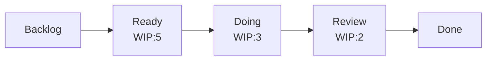

# Kanban

Pull-based flow system for continuous delivery. Optimizes for **flow**, not iterations.

## Core Principles

1. Visualize work.
2. Limit Work-In-Progress (WIP).
3. Manage flow.
4. Make policies explicit.
5. Implement feedback loops.
6. Improve collaboratively (evolve experimentally).

## Board Layout

Columns reflect your **actual workflow stages**, not Scrum ceremonies.

## WIP Limits

- Set per column (e.g., Doing: 3, Review: 2).
- Rule: cannot pull new work if column is at limit — help finish what's there.
- Start with `WIP ≈ team size` and tune downward.
- Exposes bottlenecks: the constrained column is your improvement target.

## Key Flow Metrics

| Metric | Definition | Use |
|--------|-----------|-----|
| **Lead Time** | Request → delivered | Customer-facing SLA |
| **Cycle Time** | Started → delivered | Team performance |
| **Throughput** | Items finished / period | Forecasting capacity |
| **WIP** | Items in progress | Flow health |

Little's Law: `Lead Time = WIP / Throughput`. Reduce WIP to reduce lead time.

## Cumulative Flow Diagram (CFD)

Stacked area chart of items per column over time. Diagnostics:
- **Widening band** → bottleneck / growing WIP.
- **Flat line** → blocked column.
- **Parallel bands** → healthy flow.

## Classes of Service

Prioritize by urgency/risk, not FIFO:
- **Expedite**: Drop everything. Usually WIP = 1.
- **Fixed date**: Deadline-driven.
- **Standard**: Default FIFO by pull order.
- **Intangible**: Tech debt, refactors.

## Cadences

Unlike Scrum, cadences decouple:
- **Daily standup**: Walk the board right-to-left, focus on blockers.
- **Replenishment**: Refill Ready column (weekly).
- **Delivery**: When items are done (continuous or on-demand).
- **Retro / Ops review**: Inspect flow metrics periodically.

## Anti-patterns

- No WIP limits → same as no Kanban.
- Board columns that don't match reality.
- Measuring individuals instead of flow.
- Ignoring aging cards (items stuck > cycle-time p85).
- Treating backlog as infinite dumping ground.
