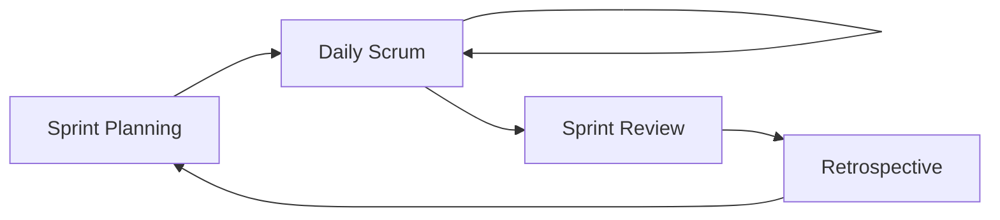

# Scrum

Agile framework for delivering value in short, iterative cycles (sprints).

## Roles

- **Product Owner (PO)**: Owns the backlog, prioritizes value, defines "what".
- **Scrum Master (SM)**: Facilitates process, removes impediments, coaches team.
- **Developers**: Self-organizing team that delivers the increment.

## Artifacts

- **Product Backlog**: Ordered list of everything that might be needed. Owned by PO.
- **Sprint Backlog**: Subset selected for the sprint + plan to deliver it.
- **Increment**: Done, potentially shippable output at end of sprint.

## Ceremonies (Events)

| Event | Duration (2-week sprint) | Purpose |
|-------|--------------------------|---------|
| Sprint Planning | ≤ 4h | Define sprint goal + select items |
| Daily Scrum | 15 min | Sync, surface blockers |
| Sprint Review | ≤ 2h | Demo increment to stakeholders |
| Retrospective | ≤ 1.5h | Inspect & adapt process |

## User Stories

Format: `As a <user>, I want <capability> so that <benefit>.`

INVEST criteria: **I**ndependent, **N**egotiable, **V**aluable, **E**stimable, **S**mall, **T**estable.

## Estimation & Velocity

- Use **story points** (Fibonacci: 1, 2, 3, 5, 8, 13) — relative complexity, not hours.
- **Velocity** = avg story points completed per sprint. Use for forecasting, never as a performance target.
- Planning Poker for estimates: team discusses, reveals simultaneously.

## Definition of Done (DoD)

Shared checklist, e.g.:
- Code reviewed and merged
- Unit + integration tests passing
- Documentation updated
- Deployed to staging
- Acceptance criteria met

## Retrospective Formats

- **Start / Stop / Continue**: Quick and focused.
- **4 Ls**: Liked, Learned, Lacked, Longed for.
- **Sailboat**: Wind (helps), Anchors (slows), Rocks (risks), Island (goal).

Always produce 1-3 concrete action items with owners.

## Anti-patterns

- Treating velocity as a productivity KPI across teams.
- Skipping retros when "busy" — they compound debt.
- PO dictating how, not what.
- Mid-sprint scope changes without swap/removal.
- "Scrum-but": adopting ceremonies without empiricism.
