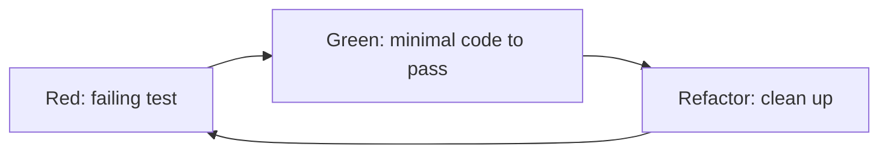

# Test-Driven Development (TDD)

Write the test first. Let tests drive design.

## The Cycle



Rules (Uncle Bob):
1. Don't write production code without a failing test.
2. Don't write more of a test than needed to fail.
3. Don't write more production code than needed to pass.

Target cycle time: **1–10 minutes**. If longer, take smaller steps.

## Test Structure: AAA

```python
def test_transfer_debits_source_account():
    # Arrange
    source = Account(balance=100)
    target = Account(balance=0)

    # Act
    transfer(source, target, amount=30)

    # Assert
    assert source.balance == 70
    assert target.balance == 30
```

## Naming

- `test_<unit>_<scenario>_<expected>` — e.g., `test_withdraw_insufficient_funds_raises`.
- Or BDD style: `it("should reject withdrawal when balance is insufficient")`.

The test name is documentation.

## Triangulation

Force generalization by adding test cases that break hard-coded returns:

```python
# 1st test: add(1, 2) == 3   → return 3
# 2nd test: add(2, 3) == 5   → forces `return a + b`
```

## What Good Tests Look Like (FIRST)

- **F**ast — milliseconds.
- **I**solated — no shared state, any order.
- **R**epeatable — same result every run.
- **S**elf-validating — pass/fail, no manual inspection.
- **T**imely — written just before the code.

## Classical vs Mockist TDD

- **Classical (Chicago)**: Real collaborators, stub only at boundaries (DB, HTTP). Tests verify state.
- **Mockist (London)**: Mock all collaborators. Tests verify interactions. Drives outside-in.

Default to classical; reach for mocks at I/O boundaries.

## Outside-In TDD

1. Write failing **acceptance test** (end-to-end feature).
2. Drop to failing **unit test** for next collaborator needed.
3. Implement, move up.
4. Repeat until acceptance test passes.

## Refactor Phase Checklist

- Remove duplication (DRY).
- Improve names.
- Extract methods / classes.
- Keep tests green the whole time — never refactor red.

## Common Smells

- Tests that break on unrelated changes → over-mocked, testing implementation.
- Slow test suite → too much I/O, push logic inward.
- "Test after" → you already know the answer; no design pressure.
- Skipped refactor step → tech debt compounds.
